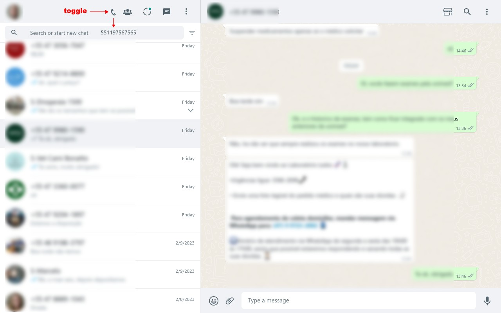

# WhatsApp Talk to Unsaved Contacts
You don't have to leave the WhatsWeb interface to talk to unsaved contacts anymore!

### After

## Install
[Userscript][1] - [Firefox][2] - [Chrome][3].

## Usage
Press the phone button, input the phone number and hit ENTER. This will reload the current page, opening a chat window to the unsaved phone number.

## Why
<!-- Focus on explaining what the item does and why users should install it -->
I use mainly WhatsApp on my notebook. This allows me to quickly message many services to requests budgets, or to check wether they provide what I need.

It does the same thing online link generators like [create.wa](https://create.wa.link/) do, but without leaving the WhatsApp web interface. It calls WhatsApp API to contact an unlisted phone number.

[Contributing](https://github.com/icetbr/my-projects/blob/main/CONTRIBUTING.md)\
[License (MIT)](https://choosealicense.com/licenses/mit/)

[1]: https://openuserjs.org/scripts/icetbr/WhatsApp_Talk_to_Unsaved_Contacts
[2]: https://addons.mozilla.org/en-US/firefox/addon/whatsapp-talk-unsaved-contacts
[3]: https://chrome.google.com/webstore/detail/webext-whatsapp-talk-to-unsaved-contacts/iaccemlleljjljglecinjhogonmhnbac
